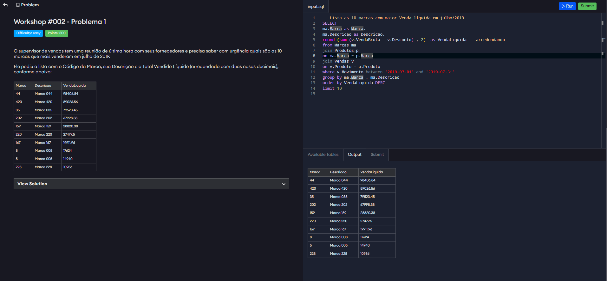

#  🚀 Desafio SQL Xperiun - Workshop SQL

## 📊 Contexto
Este projeto faz parte do desafio SQL da plataforma Xperiun. 
O objetivo é demonstrar habilidades práticas em SQL aplicadas a um cenário de análise de vendas em uma empresa de varejo.

Imagine: o time de vendas, a diretoria e o marketing precisam de informações rápidas para tomar decisões estratégicas. Aqui entra a análise de dados! 💡

---

## 📝 Problema 1: Top 10 marcas por venda líquida em Julho/2019

O supervisor de vendas precisava de forma urgente identificar as 10 marcas com maior venda líquida no mês de julho de 2019, incluindo:
- Código da Marca
- Descrição da Marca
- Total Vendido Líquido (arredondado com duas casas decimais)

---

## 💡 Estratégia de Resolução
1. Relacionei as tabelas de Marcas, Produtos e Vendas usando **JOINs**, para combinar as informações necessárias.
2. Calculei a **venda líquida** subtraindo os descontos da venda bruta.
3. Agrupei os dados por marca para somar as vendas.
4. Ordenei os resultados do maior para o menor valor de venda líquida.
5. Limitei a consulta às 10 marcas mais vendidas.

---

## 🖥 Query SQL
```sql
-- Lista as 10 marcas com maior Venda líquida em julho/2019 
SELECT ma.Marca as Marca, 
ma.Descricao as Descricao, 
sum (v.VendaBruta - v.Desconto) as VendaLiquida 
from Marcas ma 
join Produtos p 
on ma.Marca = p.Marca 
join Vendas v 
on v.Produto = p.Produto 
where v.Movimento 
between '2019-07-01' and '2019-07-31' 
group by ma.Marca , ma.Descricao 
order by VendaLiquida DESC 
limit 10
```

---





## 🧩 Problema 2 — Vendedores que Concedem Mais Descontos (Jan–Nov/2019)

O diretor percebeu que o lucro está diminuindo e pediu um relatório com:
- Nome do vendedor
- Total bruto vendido
- Percentual de desconto 
- Venda líquida
- Tudo referente ao período de janeiro a novembro de 2019.
  
---

## 💡 Estratégia de Resolução
1. Relacionei as tabelas de Vendas e Vendedores usando **JOIN**.
2. Calculei o total bruto e o total de desconto por vendedor.
3. Calculei o percentual de desconto aplicado.
4. Exibi o total líquido após descontos, ordenando do maior para o menor volume de vendas


---

## 🖥 Query SQL
```sql
 
select
v.nome as nome ,
round(sum (ve.VendaBruta), 2) as VendaBruta,
case
    when sum (ve.Desconto) = 0
    then 0
    else sum (ve.Desconto) / sum(ve.VendaBruta) 
end  as PercDesconto,
round (sum (ve.VendaBruta - ve.Desconto) , 2) as VendaLiquida
from Vendedores v
join vendas ve
on v.Vendedor = ve.Vendedor
where ve.movimento between '2019-01-01' and '2019-11-30'
group by v.nome

```

---


